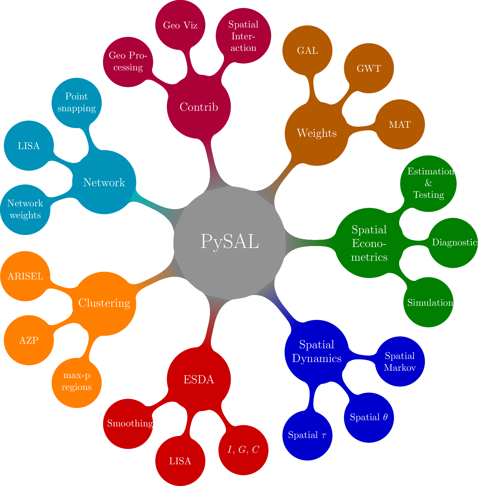

---

<section>

<h1>Spatio-temporal analysis of socioeconomic neighborhoods</h1>  

 Sergio Rey, Elijah Knaap, Levi Wolf, Wei Kang, Su Han

</img>
</img>

<code>#SciPy2018</pre></code>
</section>

## Neighborhoods Matter

## {data-background="images/nyt1.png" data-background-size="1400px"}

## {data-background="images/nyt2.png" data-background-size="1400px"}

## Neighborhood Effects

</img>

## Approaches to Neighborhoods

- neighborhood effects
  - massive literature
    - predictive postcode 
  - neighborhoods as "containers"
- neighborhood dynamics
  - process based models
  - prescriptive models
  - descriptive (exploratory models)

## (Temporal) Neighborhood Analysis Challenging

- what defines a neighborhood?
- "neighborhoods" change over time
    - compositionally
    - geographically/geometrically

## Neighborhoods in the Social Sciences

- effects
- dynamics
- largely separate

<!--(need to be brought together - exposure histories and latencies)
-->

## Project Goals

- open urban data science
- new space-time analytics for neighborhood dynamics
- new spatially explicit approaches towards neighborhood dynamics
- reproducible harmonization

## the Python ecosystem is ripe for neighborhood analysis

- pysal ecosystem
- geopandas
- scikit + statsmodels
- interactive viz and dashboard tools

## Open Source Longitudinal Neighborhood Analysis Package 
#### OSLNAP
 

- Data
- Analytics
- Visualization <!--(note that we're still working on this piece so wont be talking about it much)-->

# Data Module

## Data Module

- enumeration units for survey data (e.g. Census) change over time
- i.e., **no consistent, stable unit** to analyze over time
- spatial units can't be subset without incurring unknown error (MAUP)

## {data-background="images/tracts.png" data-background-size="contain"}

## {data-background="images/tract_isolated.png" data-background-size="contain"}

## {data-background="images/tract_translucent.png" data-background-size="contain"}

<!--(speaker explains point is that we can't naively assign statistics to arbitrary geographies, we need special tools to do that)

in the data module we provide tools to solve that problem in one of three ways:

- importing pre-standardized dataset from common provider
- providing statistical tools for harmonizing data to the spatial unit of the user's choice
- allowing the user to develop their own spatial units
-->

## Import from external timeseries databases

</img>
</img>
</img>

<!--
(speaker describes how these are cleaned for common issues, standardized into consistent format, cached and optimized for modeling & viz)
-->

## Harmonize/standardize new datasets to common boundaries

[ not sure the visual here ]

## Develop new primitive spatial units

[picture of intersection operation that creates small units]

<!-- (speaker describes how we use spatial methods to develop reasonable estimates of the statistics within these units) -->

# Analytics I:  Identifying Neighborhoods

## {data-background="images/chicago_school.gif"}
<!-- http://beslter.org/landing-Baltimore-School-of-Ecology.html
(speaker explains that the concept is 100 years old, but we have better statistics for identifying the same kinds of patterns but they are difficult to use. that's one of the voids we fill. we also let researchers examine how these lines blur and shift over time)
-->
##  {data-background="images/output-area-classification.png" data-background-size="1300px"}

<!-- 
Current Art: Geodemographics
- use cluster analysis to derive neighborhoods
- commercial example?
-->

## {data-background="images/dc_clusters.png" data-background-size="900px"}

## {data-background="images/saopaulo_clusters.png" data-background-size="1250px"}
<!-- will replace image -->

# Analytics II:  Measuring Neighborhood Change

## Temporal Geodemographics

<!-- will replace image, first is static -->

<section class="fragment">

</img>

</section>

<!-- will replace image with better looking -->

<section class="fragment">

</img>

</section>

## Modeling Neighborhood Change
- A dynamic perspective
    - Transition analysis
        - Markov Chains
        - Spatial Markov Chains
- A holistic perspective
    - Sequence analysis
        - Optimal matching
        - Edit distance
    - View each neighborhood trajectory as a whole

## Transition analysis

## Markov Chains

</img>

## Spatial Markov Chains

</img>

## Sequence Analysis

##  {data-background="images/sequence_A.png" data-background-size="600px"}

<!-- arbitrary first sequence -->

##  {data-background="images/sequence_B.png" data-background-size="600px"}

<!-- arbitrary second sequence -->

##  {data-background="images/sequence_both.png" data-background-size="600px"}

<!-- aligned -->

## {data-background="images/sequence_both_hamming.png" data-background-size="600px"}

<!-- force-aligned -->

## {data-background="images/sequence_both_aligned.png" data-background-size="600px"}

<!-- optimal aligned -->

## {data-background="images/sequence_both_aligned_annotated.png" data-background-size="600px"}

<!-- annotated -->

# Vizualization

## {data-background="images/interface.png" data-background-size="1000px"}

## Thanks

</img>

